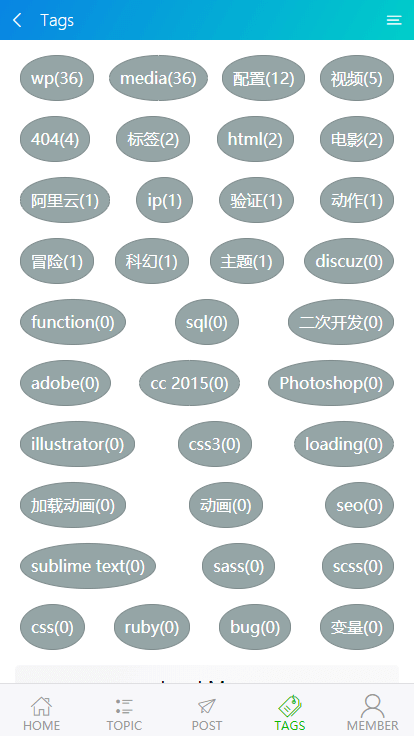
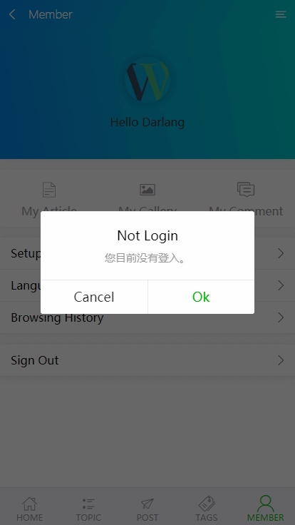
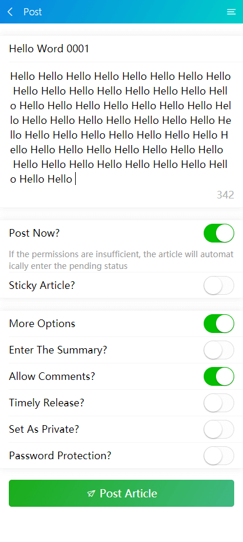
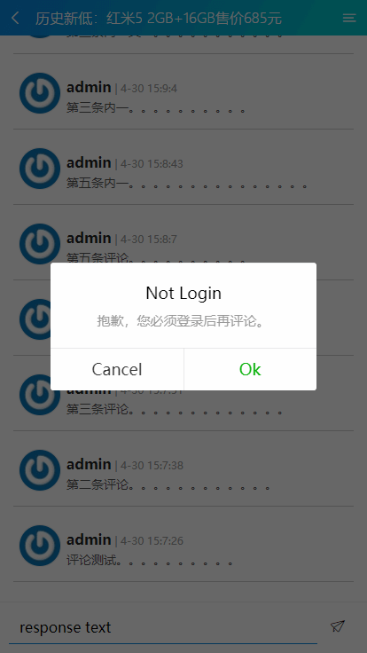

<a href="http://www.darlang.com" align="center">


</a>
<center>

# **VueWPress**

</center>

[中文简述 ~ VueWPress](./README_CN.md)


## Prerequisites

> 1. First, You must **Star** this repository. (*￣︶￣)

> 2. Need to install and running WordPress above version 4.4 ,and open REST API.

> 3. modify `src/utils/api.js` file, change youre config.  *「E.g: site url, site language, site protocol etc.」*

> 4. After vueWPress 0.23 release, you need to install a plugin JWT Authentication for WP-API, Can be downloaded via background plugin search or [check here](https://wordpress.org/plugins/jwt-authentication-for-wp-rest-api/)

> 4.1 Modify the wp-config.php file in Wordpress root

> 4.1.2 Find: `define('NONCE_SALT'`

> 4.1.3 Add the following to the line under `define('NONCE_SALT'`

``` bash
define('JWT_AUTH_SECRET_KEY', 'you-64-secret-key');
#the random key here https://api.wordpress.org/secret-key/1.1/salt/
define('JWT_AUTH_CORS_ENABLE', true);
```

> 4.1.4 `you-64-secret-key` Is a 64-bit random key, more: [check here](https://wordpress.org/plugins/jwt-authentication-for-wp-rest-api/)

## Build Setup

``` bash
# install dependencies
npm install

# serve with hot reload at localhost:8088
npm run start

#  build for development
npm run dev

# build for production
npm run build
```

## What Can I Do ?
> 1. Show home on the home page. [jump](#home) 「ver: 0.1」

> 2. Show post on the article page. [jump](#article) 「ver: 0.1」

> 3. Show topic on the topic page. [jump](#topic) 「ver: 0.12」

> 4. Show topic detail on the detail page. 「ver: 0.12」

> 5. Show tags on the tags page. [jump](#tags) 「ver: 0.16」

> 6. Show tag detail on the detail page. 「ver: 0.16」

> 7. Show All media on the gallery page. 「ver: 0.16」

> 8. Show All comment on the comments page. 「ver: 0.19」

> 9. Show article on the articles page. [jump](#articles) 「ver: 0.23」

> 10. Added comments on article page. [jump](#comment) 「ver: 0.31」

> 11. Increase article publishing capabilities.  [jump](#post) 「ver: 0.31」

> 12. Added user center to display nicknames, avatars, and logouts. [jump](#member) 「ver: 0.31」

> 13. Added login and registration functions. [jump](#login) 「ver: 0.31」

> 14. More features are in development ...

## Preview Me
### Home


[Back Up](#vuewpress)

---

### Articles


[Back Up](#vuewpress)

---

### Article


[Back Up](#vuewpress)

---

### Topic


[Back Up](#vuewpress)

---

### Tags


[Back Up](#vuewpress)

---

### Member


[Back Up](#vuewpress)

---

### Login


[Back Up](#vuewpress)

---


### Post


[Back Up](#vuewpress)

---


### Comment


[Back Up](#vuewpress)

---