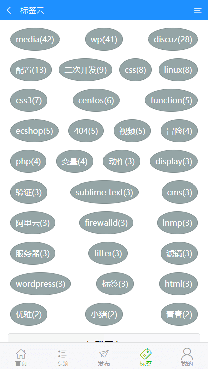
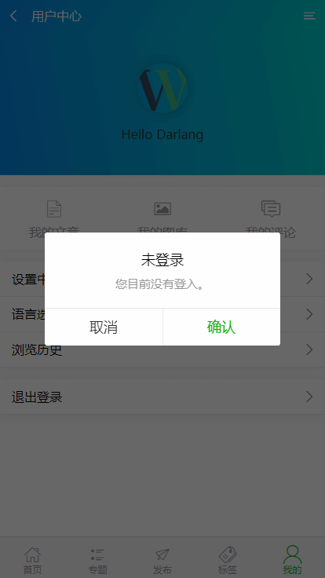
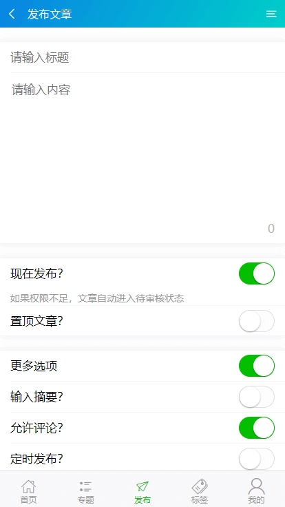
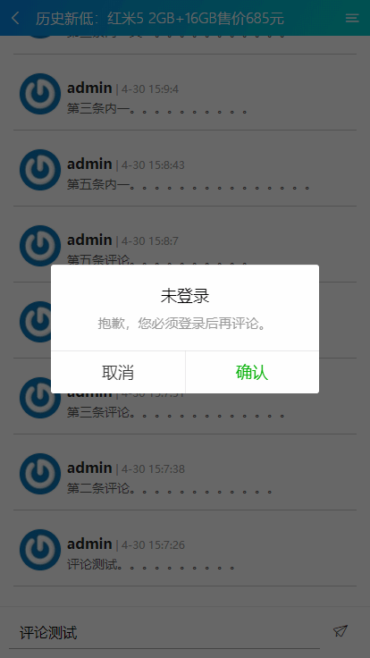

<a href="http://www.darlang.com" align="center">


</a>
<center>

# **VueWPress**

</center>

[Englist Document ~ VueWPress](./README.md)


## 前提条件
> 1. 为了保证正常运行项目，你需要先 **Star** ，否则项目运行可能会出错。 (*￣︶￣)

> 2. 需要在版本 4.4 之上安装并运行 WordPress ,并 REST API 处于开启状态。

> 3. 修改 `src/utils/api.js` 文件, 修改成你的博客配置  *「例如: 你的站点地址, 你的站点语言, 你的站点协议等等」*

> 4. vueWPress 0.23 版本以后，需要安装一个插件 JWT Authentication for WP-API ,可通过后台插件搜索或者[查看这里](https://wordpress.org/plugins/jwt-authentication-for-wp-rest-api/)下载

> 4.1 修改 Wordpress 根目录下的 wp-config.php 文件

> 4.1.2 查找：`define('NONCE_SALT'`

> 4.1.3 在 `define('NONCE_SALT'` 下方新增如下内容

``` bash
define('JWT_AUTH_SECRET_KEY', 'you-64-secret-key');
#这里查看随机密钥 https://api.wordpress.org/secret-key/1.1/salt/
define('JWT_AUTH_CORS_ENABLE', true);
```

> 4.1.4 `you-64-secret-key` 是64位的随机密钥，更多配置 [点击这里](https://wordpress.org/plugins/jwt-authentication-for-wp-rest-api/)

## 使用步骤

``` bash
# 安装依赖关系
npm install

# 启动运行后，在 localhost：8088 打开，默认具有热加载
npm run start

#  开发环境命令，文件较大用于开发环境
# 本地会生成 dist 文件夹，可用于线上部署
npm run dev

# 生产环境命令，文件较小适合线上部署
# 本地会生成 dist 文件夹，可用于线上部署
npm run build
```

## 有什么功能？
> 1. 首页展示文章列表。 [Jump](#首页) 「ver: 0.1」

> 2. 内容页显示文章详情。 [Jump](#文章) 「ver: 0.1」

> 3. 专题页显示页面专题。 [Jump](#专题中心) 「ver: 0.12」

> 4. 专题详情页显示专题内容。「ver: 0.12」

> 5. 标签云页显示标签集合。 [Jump](#标签云) 「ver: 0.16」

> 6. 标签页显示标签相关文章。「ver: 0.16」

> 7. 图库页显示所有媒体文件。「ver: 0.16」

> 8. 言论页显示所有评论。「ver: 0.19」

> 9. 文章列表页显示所有文章。 [jump](#文章列表) 「ver: 0.23」

> 10. 文章页面新增评论。 [jump](#文章评论) 「ver: 0.31」

> 11. 增加发布文章功能。  [jump](#发布文章) 「ver: 0.31」

> 12. 新增用户中心，可显示昵称、头像，退出登录。 [jump](#用户中心) 「ver: 0.19」

> 13. 新增登录、注册功能。 [jump](#登录) 「ver: 0.19」

> 14. 更多功能正在开发中 ...

## 预览界面
### 首页


[返回](#vuewpress)

---

### 文章列表


[Back Up](#vuewpress)

---

### 文章


[返回](#vuewpress)

---

### 专题中心


[返回](#vuewpress)

---

### 标签云


[Back Up](#vuewpress)

---

### 用户中心


[Back Up](#vuewpress)

---

### 登录


[Back Up](#vuewpress)

---

### 发布文章


[Back Up](#vuewpress)

---

### 文章评论


[Back Up](#vuewpress)

---