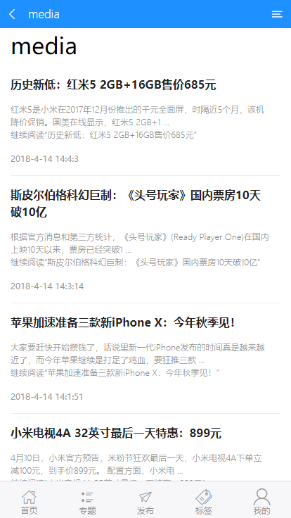
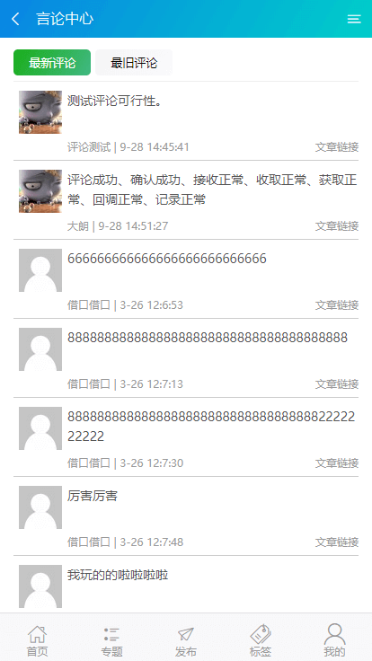

<a href="http://www.darlang.com" align="center">


</a>
<center>

# **VueWPress**

</center>

[Englist Document ~ VueWPress](./README.md)


## 前提条件
> 1. 为了保证正常运行项目，你需要先 **Star** ，否则项目运行可能会出错。 (*￣︶￣)

> 2. 需要在版本 4.4 之上安装并运行 WordPress ,并 REST API 处于开启状态。

> 3. 修改 `src/utils/api.js` 文件, 修改成你的博客配置  *「例如: 你的站点地址, 你的站点语言, 你的站点协议等等」*


## 使用步骤

``` bash
# 安装依赖关系
npm install

# 启动运行后，在 localhost：8088 打开，默认具有热加载
npm run strat

#  开发环境命令，文件较大用于开发环境
# 本地会生成 dist 文件夹，可用于线上部署
npm run dev

# 生产环境命令，文件较小适合线上部署
# 本地会生成 dist 文件夹，可用于线上部署
npm run build
```

## 有什么功能？
> 1. 首页展示文章列表。 [Jump](#首页) 「ver: 0.1」

> 2. 内容页显示文章详情。 [Jump](#文章) 「ver: 0.1」

> 3. 专题页显示页面专题。 [Jump](#专题中心) 「ver: 0.12」

> 4. 专题详情页显示专题内容。 [Jump](#专题详情) 「ver: 0.12」

> 5. 标签云页显示标签集合。 [Jump](#标签云) 「ver: 0.16」

> 6. 标签页显示标签相关文章。 [Jump](#标签页) 「ver: 0.16」

> 7. 图库页显示所有媒体文件。 [jump](#图库中心) 「ver: 0.16」

> 8. 言论页显示所有评论。 [jump](#言论中心) 「ver: 0.19」

> 9. 文章列表页显示所有文章。 [jump](#文章列表) 「ver: 0.19」

> 10. 更多功能正在开发中 ...

## 预览界面
### 首页


[返回](#vuewpress)

---

### 文章列表


[Back Up](#vuewpress)

---

### 文章


[返回](#vuewpress)

---

### 专题中心


[返回](#vuewpress)

---

### 专题详情


[返回](#vuewpress)

---

### 标签云


[Back Up](#vuewpress)

---

### 标签页


[Back Up](#vuewpress)

---

### 图库中心


[Back Up](#vuewpress)

---

### 言论中心


[Back Up](#vuewpress)

---